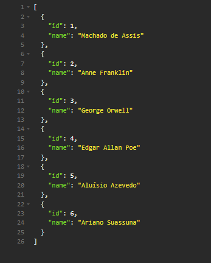
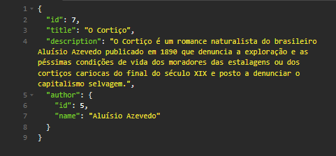
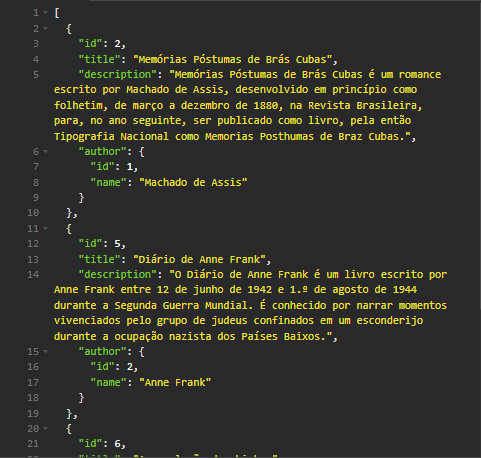

# Library API

**Descrição**

 Esse é um projeto de API de biblioteca no framework ASP.NET Core para gerenciar livros e autores.

**Recursos**

* CRUD com livros
* CRUD com autores
* Armazenamento em SQLite

**Objetivos**

O objetivo foi basicamente para eu aprender a mexer com o Entity Framework.

**Instruções de instalação**

**Tecnologias utilizadas**

* .NET 8.0.0
* Entity Framework Core
* SQLite

**Instalação do aplicativo**

1. Entre na pasta do aplicativo
2. Execute `dotnet ef migrations add InitialCreate` para iniciar uma migração, caso ainda não tenha sido feita
3. Execute `dotnet ef database update` para criar o banco de dados e aplicar a migração a ele
4. Execute `dotnet run` para iniciar a API em modo de desenvolvimento

**Screenshots**

* `GET /authors`

* `GET /books/<id>`

* `GET /books`
